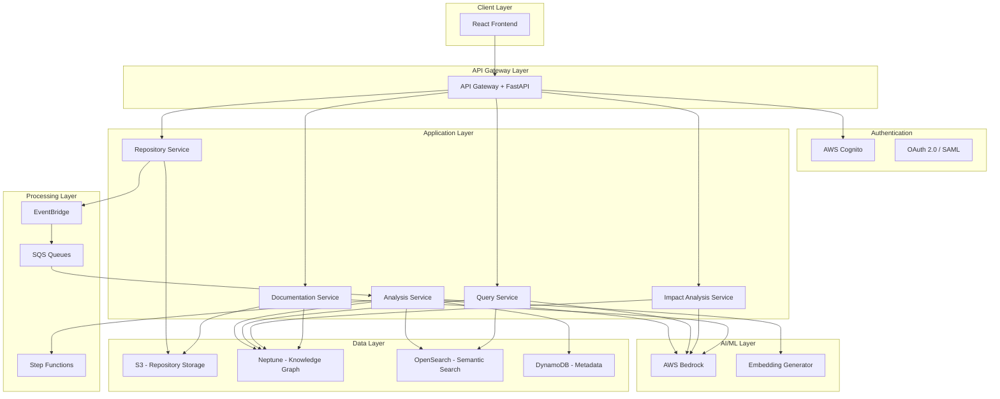

# Design Document: CodeSaarthi AI Platform

## Overview

CodeSaarthi AI is a cloud-native, AI-powered developer onboarding platform built on AWS serverless architecture. The platform analyzes Git repositories to construct a semantic knowledge graph, enabling natural language queries, impact analysis, and automated documentation generation.

The system follows a microservices architecture with clear separation between ingestion, analysis, storage, and query layers. All components are designed for horizontal scalability, high availability, and security.

### Key Design Principles

1. **Serverless-First**: Leverage AWS Lambda and managed services to minimize operational overhead
2. **Event-Driven**: Use asynchronous processing for long-running analysis tasks
3. **Separation of Concerns**: Clear boundaries between ingestion, analysis, storage, and presentation layers
4. **Idempotency**: All operations designed to be safely retryable
5. **Security by Default**: Encryption at rest and in transit, RBAC for all resources

## Architecture

### High-Level Architecture



### Component Architecture

The system is organized into five primary layers:

1. **Client Layer**: React-based web application providing the user interface
2. **API Gateway Layer**: FastAPI application handling HTTP requests, authentication, and routing
3. **Application Layer**: Business logic services implemented as Lambda functions
4. **AI/ML Layer**: AWS Bedrock for LLM capabilities and custom embedding generation
5. **Data Layer**: Specialized storage systems for different data types

## Components and Interfaces

### 1. Repository Service

**Responsibility**: Manage repository connections, cloning, and update synchronization.

**Key Operations**:
- `connect_repository(repo_url, auth_token) -> repository_id`
- `clone_repository(repository_id) -> s3_location`
- `sync_repository(repository_id) -> changed_files[]`
- `disconnect_repository(repository_id) -> success`

**Storage**:
- Repository metadata in DynamoDB
- Repository files in S3 (organized by repository_id/commit_hash/)

**Events Emitted**:
- `repository.connected`
- `repository.cloned`
- `repository.updated`

### 2. Analysis Service

**Responsibility**: Perform static code analysis, build call graphs, and construct the knowledge graph.

**Key Operations**:
- `analyze_repository(repository_id) -> analysis_job_id`
- `analyze_incremental(repository_id, changed_files[]) -> analysis_job_id`
- `extract_dependencies(file_path) -> dependency_graph`
- `generate_call_graph(file_path) -> call_graph`
- `detect_language(file_path) -> language`
- `classify_file(file_path) -> file_type`

**Processing Pipeline** (orchestrated by Step Functions):
1. **Language Detection**: Identify programming languages for all files
2. **Parsing**: Parse source files into ASTs using language-specific parsers
3. **Dependency Extraction**: Build dependency graphs from imports/requires
4. **Call Graph Generation**: Analyze function/method invocations
5. **Entity Extraction**: Identify classes, functions, interfaces, modules
6. **Embedding Generation**: Create vector embeddings for all entities
7. **Knowledge Graph Construction**: Store entities and relationships in Neptune
8. **Index Creation**: Index embeddings in OpenSearch

**Technology Stack**:
- Tree-sitter for multi-language parsing
- NetworkX for graph construction
- Custom embedding models or AWS Bedrock Titan Embeddings

### 3. Knowledge Graph Service

**Responsibility**: Manage the semantic knowledge graph in Amazon Neptune.

**Graph Schema**:

```
Nodes:
- Repository (id, name, url, language[])
- Module (id, name, path, complexity)
- Class (id, name, path, line_start, line_end)
- Function (id, name, path, line_start, line_end, complexity)
- Interface (id, name, path)
- Configuration (id, name, path, type)

Edges:
- CONTAINS (Repository -> Module, Module -> Class, etc.)
- IMPORTS (Module -> Module)
- INHERITS (Class -> Class)
- IMPLEMENTS (Class -> Interface)
- CALLS (Function -> Function)
- DEPENDS_ON (Module -> Module)
- CONFIGURES (Configuration -> Module)
- DATA_FLOW (Function -> Function)
```

**Key Operations**:
- `add_entity(entity_type, properties) -> entity_id`
- `add_relationship(source_id, relationship_type, target_id) -> relationship_id`
- `query_graph(gremlin_query) -> results[]`
- `find_dependencies(entity_id, depth) -> entity_ids[]`
- `find_dependents(entity_id, depth) -> entity_ids[]`

### 4. Query Service

**Responsibility**: Process natural language queries and return contextual answers.

**Query Processing Pipeline**:
1. **Query Understanding**: Use AWS Bedrock to parse intent and extract entities
2. **Semantic Search**: Generate query embedding and search OpenSearch for similar code entities
3. **Graph Traversal**: Query Neptune for relationships and context
4. **Context Assembly**: Gather relevant code snippets, documentation, and metadata
5. **Answer Generation**: Use AWS Bedrock to generate natural language explanation
6. **Visualization**: Generate diagrams for execution flows or architecture

**Key Operations**:
- `process_query(query_text, user_expertise_level) -> answer`
- `semantic_search(query_embedding, top_k) -> entities[]`
- `generate_explanation(context, expertise_level) -> explanation`
- `visualize_flow(entry_point, exit_point) -> diagram`

**Expertise Level Adaptation**:
- **Beginner**: Include foundational concepts, detailed step-by-step explanations, links to learning resources
- **Intermediate**: Balanced detail, focus on practical implementation patterns
- **Expert**: Concise technical details, performance implications, edge cases

### 5. Impact Analysis Service

**Responsibility**: Analyze proposed code changes and assess downstream impact.

**Analysis Algorithm**:
1. **Change Detection**: Identify modified entities (functions, classes, modules)
2. **Direct Dependencies**: Query Neptune for immediate dependents
3. **Transitive Dependencies**: Traverse dependency graph up to 5 levels
4. **API Impact**: Identify public interfaces and external consumers
5. **Breaking Change Detection**: Compare signatures and contracts
6. **Risk Scoring**: Calculate risk level based on impact breadth and depth
7. **Test Recommendation**: Suggest test coverage based on affected components

**Risk Calculation**:
```
risk_score = (num_affected_modules * 1.0) + 
             (num_affected_functions * 0.5) + 
             (has_breaking_changes * 5.0) +
             (max_dependency_depth * 0.3)

if risk_score < 3: risk_level = LOW
elif risk_score < 10: risk_level = MEDIUM
else: risk_level = HIGH
```

**Key Operations**:
- `analyze_impact(changed_files[], changed_entities[]) -> impact_report`
- `detect_breaking_changes(old_signature, new_signature) -> is_breaking`
- `calculate_risk_score(impact_data) -> risk_level`
- `recommend_tests(affected_entities[]) -> test_recommendations[]`

### 6. Documentation Service

**Responsibility**: Generate and maintain automated documentation.

**Documentation Types**:
1. **Module README**: Overview, purpose, dependencies, usage examples
2. **API Reference**: Function signatures, parameters, return types, examples
3. **Architecture Overview**: System structure, component relationships, data flows

**Generation Pipeline**:
1. **Content Extraction**: Gather entity information from Knowledge Graph
2. **Context Assembly**: Collect related entities, usage patterns, examples
3. **Template Selection**: Choose appropriate documentation template
4. **Content Generation**: Use AWS Bedrock to generate natural language documentation
5. **Formatting**: Apply markdown formatting and code highlighting
6. **Versioning**: Tag documentation with code version/commit hash
7. **Storage**: Save to S3 with version metadata

**Key Operations**:
- `generate_module_readme(module_id) -> markdown_content`
- `generate_api_reference(repository_id) -> markdown_content`
- `generate_architecture_doc(repository_id) -> markdown_content`
- `identify_undocumented_entities(repository_id) -> entity_ids[]`
- `suggest_docstring(entity_id) -> docstring_content`
- `version_documentation(repository_id, commit_hash) -> version_id`

### 7. Authentication and Authorization Service

**Responsibility**: Manage user authentication and access control.

**Implementation**: AWS Cognito with custom authorizers

**Key Operations**:
- `authenticate_user(credentials) -> jwt_token`
- `authorize_request(jwt_token, resource, action) -> allowed`
- `get_user_permissions(user_id) -> permissions[]`
- `check_repository_access(user_id, repository_id) -> has_access`

**Permission Model**:
```
Roles:
- Admin: Full access to all repositories and system configuration
- Developer: Read/write access to assigned repositories
- Viewer: Read-only access to assigned repositories

Permissions:
- repository:read
- repository:write
- repository:delete
- analysis:trigger
- query:execute
- documentation:generate
```

## Data Models

### Repository Metadata (DynamoDB)

```typescript
interface Repository {
  repository_id: string;          // Partition key
  name: string;
  url: string;
  provider: 'github' | 'gitlab' | 'bitbucket';
  owner_id: string;
  created_at: timestamp;
  last_analyzed_at: timestamp;
  last_commit_hash: string;
  languages: string[];
  lines_of_code: number;
  analysis_status: 'pending' | 'in_progress' | 'completed' | 'failed';
  access_token_encrypted: string;
}
```

### Analysis Job (DynamoDB)

```typescript
interface AnalysisJob {
  job_id: string;                 // Partition key
  repository_id: string;          // GSI
  job_type: 'full' | 'incremental';
  status: 'queued' | 'running' | 'completed' | 'failed';
  started_at: timestamp;
  completed_at: timestamp;
  files_analyzed: number;
  entities_extracted: number;
  error_message?: string;
}
```

### Code Entity (Neptune + OpenSearch)

```typescript
interface CodeEntity {
  entity_id: string;
  entity_type: 'module' | 'class' | 'function' | 'interface';
  name: string;
  qualified_name: string;
  file_path: string;
  line_start: number;
  line_end: number;
  language: string;
  complexity: number;
  embedding: number[];            // Vector embedding
  documentation: string;
  last_modified: timestamp;
  author: string;
}
```

### Query Log (DynamoDB)

```typescript
interface QueryLog {
  query_id: string;               // Partition key
  user_id: string;                // GSI
  repository_id: string;
  query_text: string;
  query_timestamp: timestamp;
  response_time_ms: number;
  entities_returned: number;
  user_expertise_level: 'beginner' | 'intermediate' | 'expert';
}
```

### Impact Report

```typescript
interface ImpactReport {
  report_id: string;
  repository_id: string;
  changed_entities: EntityChange[];
  affected_modules: string[];
  affected_functions: string[];
  transitive_dependencies: DependencyTree;
  breaking_changes: BreakingChange[];
  risk_level: 'low' | 'medium' | 'high';
  risk_score: number;
  test_recommendations: TestRecommendation[];
  generated_at: timestamp;
}

interface EntityChange {
  entity_id: string;
  change_type: 'added' | 'modified' | 'deleted';
  old_signature?: string;
  new_signature?: string;
}

interface BreakingChange {
  entity_id: string;
  change_description: string;
  affected_consumers: string[];
}

interface TestRecommendation {
  test_type: 'unit' | 'integration' | 'e2e';
  target_entity: string;
  priority: 'high' | 'medium' | 'low';
  rationale: string;
}
```

## Correctness Properties

*A property is a characteristic or behavior that should hold true across all valid executions of a system—essentially, a formal statement about what the system should do. Properties serve as the bridge between human-readable specifications and machine-verifiable correctness guarantees.*


### Property 1: Repository Authentication Round Trip
*For any* repository connection with valid credentials, authenticating and then cloning should result in the repository files being present in secure storage.
**Validates: Requirements 1.4, 1.5**

### Property 2: Incremental Analysis Efficiency
*For any* repository update, incremental analysis should only process files that have changed, not the entire repository.
**Validates: Requirements 1.6**

### Property 3: Directory Hierarchy Completeness
*For any* repository, the extracted directory hierarchy should match the actual repository structure with all directories and files represented.
**Validates: Requirements 2.1**

### Property 4: File Classification Completeness
*For any* repository, every file should be assigned both a programming language and a file type classification.
**Validates: Requirements 2.2, 2.3**

### Property 5: Dependency Graph Completeness
*For any* repository, the dependency graph should include all internal module dependencies and all external package dependencies.
**Validates: Requirements 2.4, 2.5**

### Property 6: Service Boundary Identification
*For any* microservices repository, the system should correctly identify service boundaries based on module organization and dependencies.
**Validates: Requirements 2.6**

### Property 7: Call Graph Completeness
*For any* repository, the call graph should include all function invocations and method invocations, including both direct and transitive call relationships.
**Validates: Requirements 3.1, 3.2, 3.3**

### Property 8: Call Graph Query Bidirectionality
*For any* function in the call graph, querying for callers and querying for callees should return complete and accurate results in both directions.
**Validates: Requirements 3.4, 3.5**

### Property 9: Knowledge Graph Entity Completeness
*For any* repository, the knowledge graph should contain nodes for all code entities (modules, classes, functions, interfaces, configurations).
**Validates: Requirements 4.1**

### Property 10: Knowledge Graph Relationship Completeness
*For any* repository, the knowledge graph should represent all relationship types (CONTAINS, IMPORTS, INHERITS, IMPLEMENTS, CALLS, DEPENDS_ON, CONFIGURES, DATA_FLOW) where they exist in the code.
**Validates: Requirements 4.2, 4.3, 4.4, 4.5, 4.6, 4.7**

### Property 11: Entity Embedding Generation
*For any* code entity added to the knowledge graph, a vector embedding should be generated and stored for semantic search.
**Validates: Requirements 4.8**

### Property 12: Metadata Indexing Completeness
*For any* code entity, the system should index all required metadata (file modification history, code ownership, complexity metrics, test coverage mapping).
**Validates: Requirements 4.9, 4.10, 4.11, 4.12**

### Property 13: Query Response Completeness
*For any* natural language query, the response should include relevant code snippets, contextual explanations, and cross-references to related components.
**Validates: Requirements 5.2, 5.3, 5.4**

### Property 14: Expertise Level Adaptation
*For any* query, the explanation depth and complexity should adapt appropriately based on the user's expertise level (detailed for Beginner, balanced for Intermediate, concise for Expert).
**Validates: Requirements 5.8, 5.9, 5.10**

### Property 15: Feature Flow Visualization Generation
*For any* request for feature flow visualization, the system should generate an end-to-end execution path diagram showing the flow through components.
**Validates: Requirements 5.11**

### Property 16: Impact Analysis Dependency Identification
*For any* proposed code change, the impact analyzer should identify all directly dependent modules and functions, as well as transitive dependencies up to 5 levels deep.
**Validates: Requirements 6.1, 6.2, 6.3**

### Property 17: API Consumer Impact Detection
*For any* code change affecting a public API, the impact analyzer should identify all consumers of that API.
**Validates: Requirements 6.4**

### Property 18: Breaking Change Detection
*For any* code change that modifies a public interface signature, the system should detect it as a potential breaking change.
**Validates: Requirements 6.5**

### Property 19: Risk Assessment Report Generation
*For any* completed impact analysis, the system should generate a risk assessment report with a categorized risk level (Low, Medium, or High) and test recommendations.
**Validates: Requirements 6.6, 6.7, 6.8**

### Property 20: Documentation Generation Completeness
*For any* analyzed repository, the system should generate all three documentation types (module README, API reference, architecture overview).
**Validates: Requirements 7.1, 7.2, 7.3**

### Property 21: Undocumented Code Identification
*For any* repository, the system should identify code sections lacking documentation and suggest appropriate docstring content.
**Validates: Requirements 7.4, 7.5**

### Property 22: Documentation Versioning Alignment
*For any* code release tag, the system should create a corresponding documentation snapshot with matching version information.
**Validates: Requirements 7.6, 7.7**

### Property 23: Query Response Time Performance
*For any* set of indexed queries, at least 95% should return results within 3 seconds, and complex graph traversal queries should return within 5 seconds for 90% of cases.
**Validates: Requirements 8.1, 8.2**

### Property 24: Concurrent Query Support
*For any* load test with up to 100 simultaneous users, the system should successfully process all queries without failures or timeouts.
**Validates: Requirements 8.3**

### Property 25: Repository Analysis Performance Scaling
*For any* repository, the initial analysis completion time should scale appropriately with codebase size (≤10 min for 100K LOC, ≤30 min for 500K LOC, ≤60 min for 1M LOC).
**Validates: Requirements 9.1, 9.2, 9.3**

### Property 26: Incremental Analysis Performance
*For any* repository update affecting up to 1,000 lines, incremental analysis should complete within 2 minutes.
**Validates: Requirements 9.4**

### Property 27: Auto-Scaling Behavior
*For any* increase in concurrent user load, the system should automatically provision additional compute resources, and when load decreases, it should deprovision unused resources.
**Validates: Requirements 10.2, 10.3**

### Property 28: Permission Enforcement
*For any* user attempting to access a repository, the system should verify their permissions and deny access if they lack the required role-based permissions.
**Validates: Requirements 11.1, 11.9**

### Property 29: Encryption in Transit
*For any* data transmission, the connection should use TLS 1.3 or higher encryption.
**Validates: Requirements 11.4**

### Property 30: Encryption at Rest
*For any* data stored in the system, it should be encrypted using AES-256 encryption.
**Validates: Requirements 11.5**

### Property 31: Audit Trail Completeness
*For any* user action or system event, an entry should be logged to the audit trail and retained for at least 90 days.
**Validates: Requirements 11.6, 11.7, 11.8**

### Property 32: Failover Behavior
*For any* service failure, the system should automatically failover to backup instances within 60 seconds.
**Validates: Requirements 12.2, 12.3**

### Property 33: Backup and Restore
*For any* 24-hour period, the system should create an automated backup, retain it for 30 days, and be able to restore from the most recent backup in case of data loss.
**Validates: Requirements 12.4, 12.5, 12.6**

### Property 34: Observability Completeness
*For any* API request, error, or system event, the system should emit structured logs and relevant metrics (response times, completion times, resource utilization).
**Validates: Requirements 13.1, 13.2, 13.3, 13.4, 13.5**

### Property 35: Alert Triggering
*For any* condition exceeding defined thresholds (error rate >5% over 5 minutes, or query response time >5s for 10% of queries), the system should trigger an alert.
**Validates: Requirements 13.6, 13.7**

### Property 36: Data Retrieval Correctness
*For any* query to the knowledge graph, semantic search, or full-text search, the system should retrieve results using the appropriate storage mechanism and return accurate data.
**Validates: Requirements 14.4, 14.5, 14.6**

### Property 37: Infrastructure Template Validation
*For any* proposed infrastructure change, the system should validate CloudFormation or Terraform templates before deployment and reject invalid templates.
**Validates: Requirements 15.2**

### Property 38: Deployment Rollback
*For any* failed deployment, the system should automatically rollback to the previous stable version.
**Validates: Requirements 15.5**

## Error Handling

### Error Categories

1. **Repository Integration Errors**
   - Invalid repository URL
   - Authentication failure
   - Network connectivity issues
   - Repository access denied

2. **Analysis Errors**
   - Unsupported file format
   - Parse errors in source code
   - Memory exhaustion for large files
   - Timeout during analysis

3. **Query Errors**
   - Malformed natural language query
   - No results found
   - Embedding generation failure
   - Graph query timeout

4. **Impact Analysis Errors**
   - Invalid change specification
   - Incomplete dependency information
   - Circular dependency detection

5. **Infrastructure Errors**
   - Service unavailability
   - Rate limiting
   - Storage quota exceeded
   - Authentication token expiration

### Error Handling Strategies

**Retry with Exponential Backoff**:
- Transient network errors
- Rate limiting errors
- Temporary service unavailability

**Graceful Degradation**:
- If semantic search fails, fallback to keyword search
- If diagram generation fails, return textual description
- If real-time analysis unavailable, use cached results

**User-Friendly Error Messages**:
- Translate technical errors into actionable guidance
- Provide suggestions for resolution
- Include support contact information for critical errors

**Circuit Breaker Pattern**:
- Prevent cascading failures when downstream services are unavailable
- Automatically retry after cooldown period
- Monitor failure rates and adjust thresholds

**Dead Letter Queues**:
- Capture failed analysis jobs for manual review
- Retry failed jobs with different parameters
- Alert administrators for persistent failures

### Error Response Format

```typescript
interface ErrorResponse {
  error_code: string;
  error_message: string;
  user_message: string;
  suggested_actions: string[];
  support_reference: string;
  timestamp: string;
}
```

## Testing Strategy

### Dual Testing Approach

The testing strategy employs both unit tests and property-based tests to ensure comprehensive coverage:

- **Unit tests**: Verify specific examples, edge cases, and error conditions
- **Property tests**: Verify universal properties across all inputs using randomized test data

Both approaches are complementary and necessary. Unit tests catch concrete bugs in specific scenarios, while property tests verify general correctness across a wide input space.

### Property-Based Testing Configuration

**Framework Selection**:
- **Python**: Use Hypothesis for property-based testing
- **TypeScript**: Use fast-check for property-based testing

**Test Configuration**:
- Minimum 100 iterations per property test (due to randomization)
- Each property test must reference its design document property
- Tag format: `# Feature: codesaarthi-ai-platform, Property {number}: {property_text}`

**Example Property Test Structure** (Python with Hypothesis):

```python
from hypothesis import given, strategies as st
import pytest

@given(
    repository=st.builds(Repository),
    credentials=st.builds(ValidCredentials)
)
def test_property_1_repository_authentication_round_trip(repository, credentials):
    """
    Feature: codesaarthi-ai-platform, Property 1: Repository Authentication Round Trip
    For any repository connection with valid credentials, authenticating and then 
    cloning should result in the repository files being present in secure storage.
    """
    # Authenticate
    auth_result = authenticate_repository(repository, credentials)
    assert auth_result.success
    
    # Clone
    clone_result = clone_repository(auth_result.repository_id)
    assert clone_result.success
    
    # Verify files in storage
    files = list_storage_files(auth_result.repository_id)
    assert len(files) > 0
    assert all(file.encrypted for file in files)
```

### Unit Testing Strategy

**Focus Areas for Unit Tests**:
1. **Specific Examples**: Test concrete scenarios like "authentication flow for GitHub"
2. **Edge Cases**: Empty repositories, single-file repositories, binary files
3. **Error Conditions**: Invalid credentials, network failures, malformed data
4. **Integration Points**: API contracts between services, data format conversions

**Example Unit Test Structure**:

```python
def test_github_repository_connection():
    """Test connecting to a GitHub repository with valid credentials."""
    repo_url = "https://github.com/example/repo"
    credentials = GitHubOAuthToken("valid_token")
    
    result = connect_repository(repo_url, credentials)
    
    assert result.success
    assert result.provider == "github"
    assert result.repository_id is not None

def test_empty_repository_analysis():
    """Test analyzing an empty repository (edge case)."""
    repo_id = create_empty_test_repository()
    
    analysis_result = analyze_repository(repo_id)
    
    assert analysis_result.status == "completed"
    assert analysis_result.files_analyzed == 0
    assert analysis_result.entities_extracted == 0
```

### Integration Testing

**Test Scenarios**:
1. End-to-end repository ingestion and analysis
2. Query processing with real knowledge graph data
3. Impact analysis with complex dependency chains
4. Documentation generation for multi-module projects

### Performance Testing

**Load Testing**:
- Simulate 100 concurrent users submitting queries
- Measure response times at 50th, 95th, and 99th percentiles
- Verify auto-scaling behavior under load

**Stress Testing**:
- Test with repositories at maximum supported size (1M LOC)
- Test with maximum dependency depth (5 levels)
- Test with maximum concurrent analysis jobs

### Security Testing

**Test Scenarios**:
1. Unauthorized access attempts
2. Token expiration and refresh
3. Encryption verification (in transit and at rest)
4. SQL injection and XSS prevention
5. Rate limiting enforcement

### Monitoring and Alerting Tests

**Test Scenarios**:
1. Verify logs are emitted for all operations
2. Verify metrics are collected and aggregated
3. Verify alerts trigger when thresholds are exceeded
4. Verify alert notifications are delivered

### Test Data Management

**Synthetic Repositories**:
- Create test repositories in each supported language
- Include various complexity levels (simple, moderate, complex)
- Include edge cases (empty files, very large files, circular dependencies)

**Property Test Generators**:
- Generate random but valid repository structures
- Generate random code entities with realistic properties
- Generate random queries with expected result patterns

### Continuous Integration

**CI Pipeline Stages**:
1. **Lint and Format**: Check code style and formatting
2. **Unit Tests**: Run all unit tests with coverage reporting
3. **Property Tests**: Run property-based tests (100+ iterations each)
4. **Integration Tests**: Run end-to-end scenarios
5. **Security Scans**: Run static analysis and dependency checks
6. **Performance Tests**: Run baseline performance tests
7. **Build and Package**: Create deployment artifacts

**Quality Gates**:
- Minimum 80% code coverage
- All property tests must pass
- No critical security vulnerabilities
- Performance within acceptable thresholds

## Deployment Architecture

### Multi-Region Deployment

**Primary Region**: us-east-1
**Secondary Region**: us-west-2

**Data Replication**:
- S3: Cross-region replication enabled
- Neptune: Read replicas in secondary region
- OpenSearch: Cross-cluster replication
- DynamoDB: Global tables

### Blue-Green Deployment

**Process**:
1. Deploy new version to "green" environment
2. Run smoke tests on green environment
3. Gradually shift traffic from blue to green (10%, 25%, 50%, 100%)
4. Monitor error rates and performance metrics
5. Rollback to blue if issues detected
6. Decommission blue environment after successful deployment

### Infrastructure as Code

**Terraform Modules**:
- `networking`: VPC, subnets, security groups
- `compute`: Lambda functions, Step Functions
- `storage`: S3 buckets, Neptune cluster, OpenSearch domain, DynamoDB tables
- `api`: API Gateway, Cognito user pools
- `monitoring`: CloudWatch dashboards, alarms, log groups

**Environment Configuration**:
- Separate Terraform workspaces for dev, staging, prod
- Environment-specific variable files
- Shared modules for common infrastructure

### Monitoring and Observability

**CloudWatch Dashboards**:
1. **System Health**: Service availability, error rates, latency
2. **Resource Utilization**: Lambda invocations, Neptune queries, OpenSearch operations
3. **Business Metrics**: Repositories analyzed, queries processed, users active
4. **Cost Tracking**: Service costs by component

**Alarms**:
- High error rate (>5% over 5 minutes)
- High latency (>5s for 10% of requests)
- Resource exhaustion (Lambda throttling, Neptune CPU >80%)
- Security events (failed authentication attempts >10/minute)

**Distributed Tracing**:
- AWS X-Ray for request tracing across services
- Correlation IDs for tracking requests end-to-end
- Performance bottleneck identification

## Security Considerations

### Authentication and Authorization

**User Authentication**:
- AWS Cognito user pools
- OAuth 2.0 for Git provider integration
- SAML 2.0 for enterprise SSO
- Multi-factor authentication (MFA) support

**Service Authentication**:
- IAM roles for Lambda functions
- Service-to-service authentication using AWS IAM
- Secrets stored in AWS Secrets Manager

### Data Protection

**Encryption**:
- TLS 1.3 for all data in transit
- AES-256 encryption for all data at rest
- KMS for key management
- Separate encryption keys per environment

**Data Isolation**:
- Repository data isolated by tenant
- Row-level security in Neptune
- Index-level security in OpenSearch
- Separate S3 prefixes per repository

### Network Security

**VPC Configuration**:
- Private subnets for compute and data layers
- Public subnets for API Gateway and load balancers
- NAT gateways for outbound internet access
- VPC endpoints for AWS services

**Security Groups**:
- Principle of least privilege
- Separate security groups per service
- No direct internet access to data stores

### Compliance

**Audit Logging**:
- All API calls logged to CloudTrail
- All user actions logged to DynamoDB
- Log retention for 90 days minimum
- Tamper-proof log storage

**Data Retention**:
- Repository data retained until explicitly deleted
- Analysis results retained for 1 year
- Query logs retained for 90 days
- Backup data retained for 30 days

## Scalability Considerations

### Horizontal Scaling

**Stateless Services**:
- All Lambda functions are stateless
- No local state stored in compute layer
- Session state stored in DynamoDB

**Data Partitioning**:
- Repository data partitioned by repository_id
- Knowledge graph partitioned by repository
- OpenSearch indices partitioned by repository

### Vertical Scaling

**Lambda Configuration**:
- Memory allocation based on workload (512MB - 3GB)
- Timeout configuration based on operation type
- Provisioned concurrency for latency-sensitive functions

**Database Scaling**:
- Neptune instance sizing based on graph size
- OpenSearch instance sizing based on index size
- DynamoDB on-demand capacity mode

### Caching Strategy

**Multi-Level Caching**:
1. **API Gateway Cache**: Cache query responses for 5 minutes
2. **Application Cache**: Redis/ElastiCache for frequently accessed data
3. **CDN Cache**: CloudFront for static assets and documentation

**Cache Invalidation**:
- Invalidate on repository updates
- TTL-based expiration for stale data
- Manual invalidation for critical updates

## Future Enhancements

### Phase 2 Features

1. **IDE Integration**: VS Code and IntelliJ plugins for in-editor assistance
2. **Real-time Collaboration**: Shared knowledge sessions for team learning
3. **Custom Model Fine-tuning**: Organization-specific model training
4. **Multi-Repository Analysis**: Cross-repository dependency tracking for microservices

### Phase 3 Features

1. **Automated Code Review**: AI-powered code review suggestions
2. **Ticket-to-Code Traceability**: Integration with JIRA/Linear
3. **Predictive Analytics**: Identify high-risk code areas before incidents
4. **Knowledge Transfer**: Automated onboarding documentation generation

## Appendix

### Technology Justification

**AWS Bedrock**: Provides access to state-of-the-art foundation models without managing infrastructure

**Amazon Neptune**: Purpose-built graph database for complex relationship queries

**Amazon OpenSearch**: Combines full-text search with vector similarity search for semantic queries

**AWS Lambda**: Serverless compute eliminates infrastructure management and enables automatic scaling

**FastAPI**: Modern Python web framework with automatic API documentation and type validation

**React**: Industry-standard frontend framework with rich ecosystem and component reusability

### Glossary of AWS Services

- **AWS Bedrock**: Managed service for foundation models
- **Amazon Neptune**: Managed graph database service
- **Amazon OpenSearch**: Managed search and analytics service
- **AWS Lambda**: Serverless compute service
- **Amazon S3**: Object storage service
- **Amazon DynamoDB**: NoSQL database service
- **AWS Cognito**: User authentication and authorization service
- **Amazon API Gateway**: API management service
- **AWS Step Functions**: Workflow orchestration service
- **Amazon EventBridge**: Event bus service
- **Amazon SQS**: Message queue service
- **AWS CloudWatch**: Monitoring and observability service
- **AWS X-Ray**: Distributed tracing service
- **AWS Secrets Manager**: Secrets management service
- **AWS KMS**: Key management service
